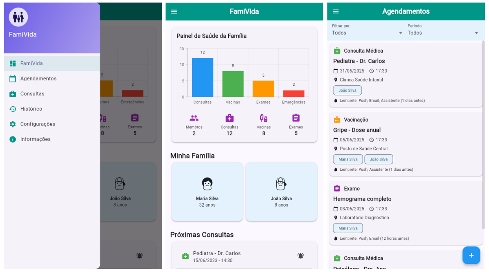

# FamiVida - Documentação Completa
integrantes:
Guilherme Ferreira,
Rebeka Farias,
Lucas Soares,
Matheus Lohan,
Eduardo Felipe,



Aplicativo completo para gerenciamento da saúde familiar com design moderno e funcionalidades avançadas.

## 🌟 Visão Geral

O **FamiVida** é um aplicativo Flutter desenvolvido para ajudar famílias a gerenciarem informações de saúde de forma centralizada, segura e intuitiva. Com interface moderna e diversas funcionalidades, o app permite:

- Controle de histórico médico familiar
- Agendamento de consultas e vacinas
- Teleconsultas compartilhadas
- Configurações de privacidade granulares

## 🛠 Funcionalidades

### 🏠 Dashboard
- Painel visual com gráficos de saúde
- Visão geral dos membros da família
- Próximas consultas agendadas

### 📅 Agendamentos
- Marcação de consultas presenciais/virtuais
- Lembretes para vacinas e exames
- Agenda compartilhada familiar

### 💻 Teleconsultas
- Integração com plataformas de vídeo
- Compartilhamento de documentos durante consultas
- Anotações colaborativas

### 🩺 Histórico Médico
- Registro centralizado de:
  - Vacinas e reforços
  - Alergias e condições crônicas
  - Receitas e exames
- Linha do tempo por membro

### 🔐 Segurança e Privacidade
- Controle de acesso por membro:
  - Totalmente privado
  - Compartilhado com responsáveis
  - Visível apenas para médicos
- Histórico de acessos

### 📊 Informações do App
- Exportação de dados em PDF/Excel
- Relatórios por período
- Sobre o aplicativo

## 📁 Estrutura do Projeto
```lib/
├── main.dart # Ponto de entrada do app
├── agendamento_lembretes.dart # Lógica de agendamentos
├── teleconsultas_page.dart # Tela de teleconsultas
├── historico_medico_page.dart # Histórico médico
├── seguranca_privacidade_page.dart # Configurações de privacidade
└── informacoes_app_page.dart # Informações e exportação
```

## ⚙️ Configuração

1. Clone o repositório:
   ```bash
   git clone https://github.com/seu-usuario/saude-familiar.git